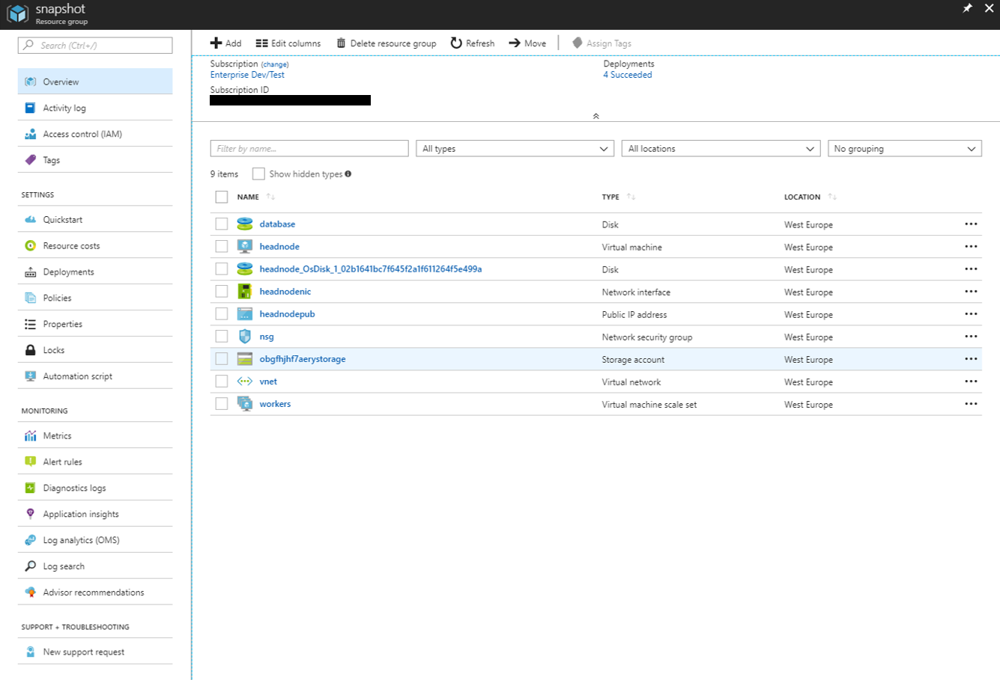
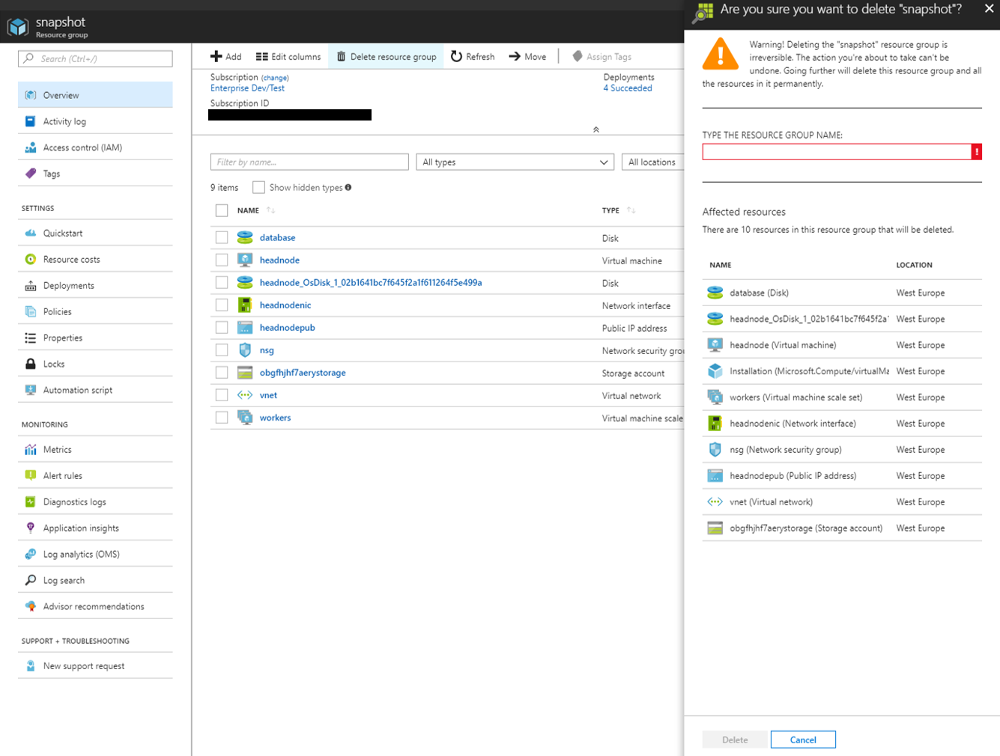

# MATLAB Distributed Computing Server on Microsoft Azure

# Requirements

Before starting, you will need the following:

- MATLAB Distributed Computing Server™ license. For more information, see [Configuring License in the Cloud](https://www.mathworks.com/support/cloud/configure-matlab-distributed-computing-server-licensing-on-the-cloud.html).

- MATLAB® R2018a and Parallel Computing Toolbox™ on your desktop.

- An Azure™ account.

# Costs
You are responsible for the cost of the Azure services used when you create cloud resources using this guide. Resource settings, such as instance type, will affect the cost of deployment. For cost estimates, see the pricing pages for each Azure service you will be using. Prices are subject to change.

# Introduction
The following guide will help you automate the process of launching MATLAB Distributed Computing Server and MATLAB job scheduler (MJS) on Azure using your Azure account. The cloud resources are created using Azure Resource Manager (ARM) templates. For information about the architecture of this solution, see [Learn About MJS Cluster Architecture](#learn-about-mjs-cluster-architecture).

# Deployment Steps

## Step 1. Launch the Template

Click the **Deploy to Azure** button below to deploy the cloud resources on Azure. This will open the Azure Portal in your web browser.

> Cluster Platform: Windows Server 2016

> MATLAB Release: R2018a

## Step 2. Configure the Cloud Resources
After you click the Deploy To Azure button above, the “Custom deployment” page will open in your browser where you can configure the parameters. It is easier to complete the steps if you position these instructions and the Azure Portal window side-by-side.

1. Specify and check the defaults for these resource parameters:

    | Parameter label                                    | Description 
    | -------------------------------------------------- | ----------- 
    | **Subscription** (required)                            | Choose an Azure subscription to use for purchasing resources.
    | **Resource group** (required)                          | Choose a name for the resource group that will hold the resources. It is recommended to create a new resource group for each deployment. This allows all resources to be deleted simultaneously.
    | **Location** (required)                                | Choose the region to start resources in. Ensure that you select a location which supports your requested instance types. To check which services are supported in each location, see [Azure Region Services](https://azure.microsoft.com/en-gb/regions/services/). 
    | **Cluster name** (required)                            | Choose a name to use for the MJS cluster. This name will be shown in MATLAB when connected to the cluster.
    | **Number of worker instances** (required)              | Choose the number of Azure instances to start for the workers.
    | **Number of workers to start on each instance** (required) | Choose the number of MATLAB workers to start on each node. Specify 1 worker for every physical core. The number of vCPUs per physical core depends on the instance family type. See the [Azure documentation](https://docs.microsoft.com/en-us/azure/virtual-machines/windows/acu) for details on vCPUs for each instance type.
    | **Size (GB) of the database data disk** (optional)    | The size of the data disk to use for the MJS database. All job and task information, including input and output data will be stored on this volume and it should therefore have enough capacity to store the expected amount of data. If this parameter is set to 0 no volume will be created and the root volume of the instance will be used for the MJS database.
    | **Instance type for the head node** (required)         | Choose the Azure instance type to use for the head node, which will run the MJS job manager. No workers will be started on this node, so this can be a smaller instance type than the worker nodes. All [Azure instance types](https://docs.microsoft.com/en-us/azure/virtual-machines/windows/sizes) are supported.
    | **Instance type for the worker nodes** (required)      | Choose the Azure instance type to use for the workers. All [Azure instance types](https://docs.microsoft.com/en-us/azure/virtual-machines/windows/sizes) are supported.
    | **IP address range of client** (required)              | Specify your IP address range that can be used to access the resources and use the form x.x.x.x/x. In a web browser search for "my ip address", copy and paste the address into the input box. Append "/32" to restrict access to your address only, or specify a CIDR range.
    | **Admin username** (required)                          | Choose the admin username for all instances. This username is required when logging into any instance using remote desktop protocol. 
    | **Admin password** (required)                          | Choose the admin password for all instances. This password is required when logging into any instance using remote desktop protocol. For the deployment to succeed, your password must meet [Azure's password requirements](https://docs.microsoft.com/en-us/azure/virtual-machines/windows/faq#what-are-the-password-requirements-when-creating-a-vm).
    
2. Tick the box to accept the Azure Marketplace terms and conditions.

3. Click the **Purchase** button.

When you click Purchase, the resources are created using Azure template deployments. Template deployment can take several minutes.

# Step 3: Connect to Your Cluster From MATLAB

1. After clicking **Purchase** you will be taken to the Azure Portal Dashboard. To montior the progress of your deployment, select your resource group from the Resource Groups panel. Wait for the all **Deployments** to reach **Succeeded**.
2. Select the Storage Account ending with **storage**. The screen should look like the one in Figure 1.

    

    *Figure 1: Resource Group On Completion*

3. Select the Files container type.
4. Select the File Share named “shared”.
5. Download the file, `cluster/<NAME>.settings`, where NAME is the name of your MATLAB job scheduler.
6. Open MATLAB.
7. In the Parallel drop-down menu in the MATLAB toolstrip select **Manage Cluster Profiles**.
8. Click **Import**.
9. Select the downloaded profile and click open.
10. Click **Set as Default**.
11. (Optional) Validate your cluster by clicking the **Validate** button.

After setting the cloud cluster as default, the next time you run a parallel language command (such as `parfor`, `spmd`, `parfeval` or `batch`) MATLAB connects to the cluster. The first time you connect, you will be prompted for your MathWorks account login. The first time you run a task on a worker it will take several minutes for the worker MATLAB to start. This delay is due to provisioning the instance disk. This is a one-time operation, and subsequent tasks begin much faster.

Your MJS cluster is now ready to use. It will remain running after you close MATLAB. Delete your cluster by following the instructions below.

**NOTE**: Use the profile and client IP address range to control access to your cloud resources. Anyone with this file can connect to your resources from a machine within the specified IP address range and run jobs on it.

# Additional Information
## Delete Your Cloud Resources
You can remove the Resource Group and all associated resources when you are done with them. Note that there is no undo. After you delete the cloud resources you cannot use the downloaded profile again.
1. Login to the Azure Portal.
2. Select the Resource Group containing your resources.
3. Select the "Delete resource group" icon to destroy all resources deplyoyed in this group.
4. You will be prompted to enter the name of the resource group to confirm the deletion.

    

## Troubleshooting
If your resource group fails to deploy, check the Deployments section of the Resource Group. It will indicate which resource deployments failed and allow you to navigate to the causing error message.

If the resource group deployed successfully but you are unable to validate the cluster you may need to view the logs on the instances to diagnose the error. The deployment logs are output to C:/Windows/Temp/MDCSLog*.txt on the instance nodes. The MJS logs are output to C:/Windows/Temp/MDCE/Log.

## Use Existing Virtual Network
You can launch the reference architecture within an existing virtual network and subnet using the azuredeploy-existing-vnet.json template. 

> Cluster Platform: Windows Server 2016

> MATLAB Release: R2018a

This template requires the following two additional parameters:

| Parameter label                                    | Description 
| -------------------------------------------------- | ----------- 
| **Virtual Network Resource ID** (required)             | The Resource ID of an existing virtual network to deploy your cluster into.
| **Subnet Name** (required)                             | The name of an existing subnet within your virtual network to deploy your cluster into.

## Learn About MJS Cluster Architecture

Parallel Computing Toolbox and MATLAB Distributed Computing Server software let you solve computationally and data-intensive programs using MATLAB and Simulink on computer clusters, clouds, and grids. Parallel processing constructs such as parallel-for loops and code blocks, distributed arrays, parallel numerical algorithms, and message-passing functions let you implement task-parallel and data-parallel algorithms at a high level in MATLAB. To learn more see the documentation: [Parallel Computing Toolbox](https://www.mathworks.com/help/distcomp) and [MATLAB Distributed Computing Server](https://www.mathworks.com/help/mdce). 

The MJS is a built-in scheduler that ships with MATLAB Distributed Computing Server. The MJS process coordinates the execution of jobs, and distributes the tasks for evaluation to the server’s individual MATLAB sessions called workers.

Microsoft Azure is a set of cloud services which allow you to build, deploy, and manage applications hosted in Microsoft’s global network of data centres. This document will help you launch a compute cluster running MDCS and MJS using compute, storage, and network services hosted by Azure. For more information about the range of services offered by Microsoft Azure, see [Azure Services](https://azure.microsoft.com/en-gb/services/). Services launched in Azure can be created, managed, and deleted using the Azure Portal UI. For more information about the Azure Portal, see [Azure Portal](https://azure.microsoft.com/en-gb/features/azure-portal/). 

The MJS cluster and the resources required by it are created using [Azure Resource Manager templates](https://docs.microsoft.com/en-gb/azure/azure-resource-manager/resource-group-overview). The cluster architecture created by the template is illustrated in Figure 2, it defines the resources below. For more information about each resource see the [Azure template reference.](https://docs.microsoft.com/en-us/azure/templates/) 

*Figure 2: Cluster Architecture*

### Networking resources
* Virtual Network (Microsoft.Network/virtualNetworks) The Virtual Network includes the following components:
    * Subnet (Microsoft.Network/virtualNetworks/subnets)
    * Network Security Group (Microsoft.Network/networkSecurityGroups) : Ingress rules from client IP address:
        * Allow 3389: Required for Remote Desktop Protocol to the cluster nodes.
        * Allow 27350 – 27257 + (4 * number of workers): Open 7 ports, plus 4 additional ports for each worker service on the Virtual Machine (VM). Required for communication from clients to the job scheduler and worker processes.
        * Allow all internal traffic: Open access to network traffic between all cluster nodes internally.
* Each instance deployed to the Virtual Network will create the following:
    * Network interface (Microsoft.Network/networkInterfaces)
    * Public IP Address (Microsoft.Network/publicIPAddresses)
    
### Instances
* Headnode instance (Microsoft.Compute/virtualMachines): A Compute instance for the cluster headnode. The MATLAB install is part of the VM image and the job database is stored either locally on the root volume, or optionally, a separate data disk can be used. Communication between clients and the headnode is secured using SSL.
  * Database Volume (optional) (Microsoft.Compute/disks): A separate data disk to store the MJS job database. This is optional, and if not chosen the root volume will be used for the job database.
  * Custom Script Extension (Microsoft.Compute/virtualMachines/extensions): An extension which configures this instance at deployment time as the headnode of the cluster.
* Worker Scaling Set (Microsoft.Compute/virtualMachineScaleSets): A scale set for worker instances to be launched into. The scaling features are not currently used. The scale set is configured to attach an extension to each instance which configures the instance at deployment time as a worker node of the cluster. Communication between clients and workers is secured using SSL.

### Storage
* Storage Account (Microsoft.Storage/storageAccounts): A standard geographically redundant storage (GRS) Storage Account which hosts the File Share used to distribute files amongst cluster instances.
* File Share created inside Storage Account. Created by the head node and mounted by all instances to K: drive. 
    * Used to distribute the Shared Secret created by head node to all worker VMs. The Shared Secret is required for worker instances to register and establish a secure connection with the job scheduler.
    * Used to distribute the Cluster Profile to clients. The Cluster Profile is required to authenticate that a user has permission to connect to the cluster.
    * Files uploaded to this File Share will be available to all workers using the K: drive.

# Enhancement Request
Provide suggestions for additional features or capabilities using the following link: [https://www.mathworks.com/cloud/enhancement-request.html](https://www.mathworks.com/cloud/enhancement-request.html)

# Technical Support
Email: `cloud-support@mathworks.com`

