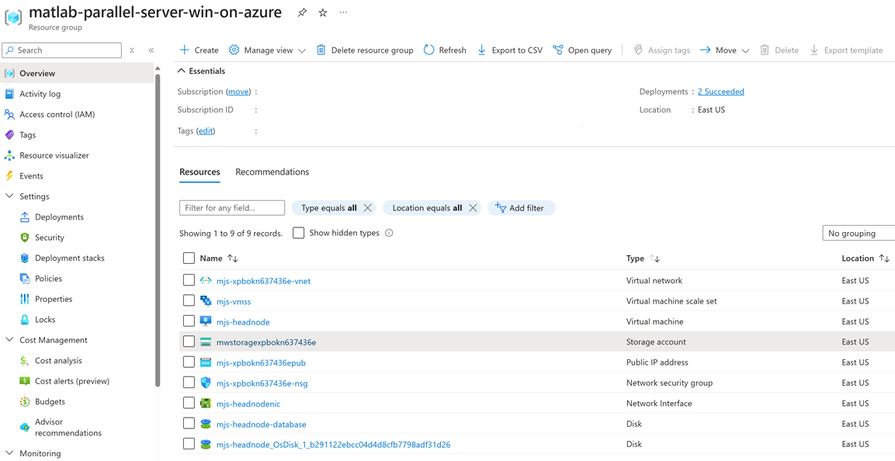
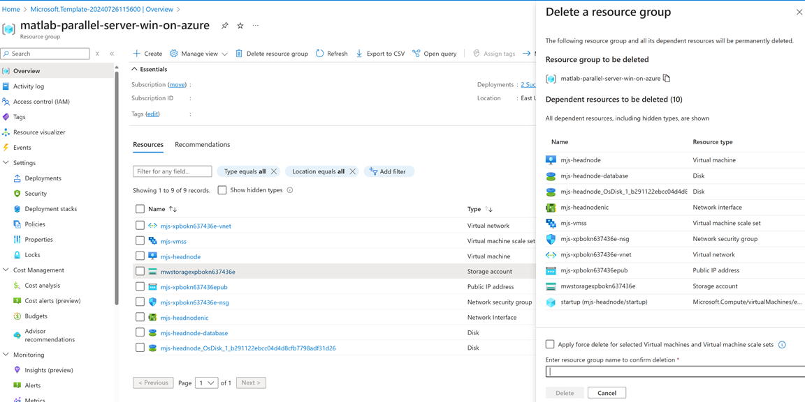

# MATLAB Parallel Server on Azure using a Network License Manager

# Requirements

Before starting, you will need the following:

- A network license manager for MATLAB hosting sufficient MATLAB Parallel Server licenses for your cluster. MathWorks provide a reference architecture to deploy a suitable [Network License Manager for MATLAB on Azure](https://github.com/mathworks-ref-arch/license-manager-for-matlab-on-azure).

## Step 1. Launch the Template

Click the **Deploy to Azure** button below to deploy the cloud resources on Azure. This will open the Azure Portal in your web browser.

> Cluster Platform: Windows Server 2016

> MATLAB Release: R2019a

For other releases, see [How do I launch a template that uses a previous MATLAB release?](#how-do-i-launch-a-template-that-uses-a-previous-matlab-release)

## Step 2. Configure the Cloud Resources
Clicking the Deploy to Azure button opens the "Custom deployment" page in your browser. You can configure the parameters on this page. It is easier to complete the steps if you position these instructions and the Azure Portal window side by side.

1. Specify and check the defaults for these resource parameters:

    | Parameter label                                 | Description
    | ----------------------------------------------- | -----------
    | **Subscription**                                | Choose an Azure subscription to use for purchasing resources.
    | **Resource group**                              | Choose a name for the resource group that will hold the resources. It is recommended to create a new resource group for each deployment. This allows all resources to be deleted simultaneously.
    | **Location**                                    | Choose the region to start resources in. Ensure that you select a location which supports your requested instance types. To check which services are supported in each location, see [Products available by region](https://azure.microsoft.com/en-gb/regions/services/).
    | **Cluster Name**                                | Choose a name to use for the cluster. This name will be shown in MATLAB when connected to the cluster.
    | **Num Worker Nodes**                            | Choose the number of Azure instances to start for the workers.
    | **Num Workers Per Node**                        | Choose the number of MATLAB workers to start on each node. Specify 1 worker for every physical core. The number of vCPUs per physical core depends on the instance family type. See the [Azure documentation](https://docs.microsoft.com/en-us/azure/virtual-machines/windows/acu) for details on vCPUs for each instance type.
    | **Database Volume Size**                        | The size of the data disk to use for the database. All job and task information, including input and output data will be stored on this volume and it should therefore have enough capacity to store the expected amount of data. If this parameter is set to 0 no volume will be created and the root volume of the instance will be used for the database.
    | **Headnode Instance Type**                      | Choose the Azure instance type to use for the head node, which will run the job manager. No workers will be started on this node, so this can be a smaller instance type than the worker nodes. The selected [virtual machine size](https://docs.microsoft.com/en-us/azure/virtual-machines/windows/sizes) must support premium storage.
    | **Worker Instance Type**                        | Choose the Azure instance type to use for the workers. The selected [virtual machine size](https://docs.microsoft.com/en-us/azure/virtual-machines/windows/sizes) must support premium storage.
    | **Client IP Address**                           | This is the IP address range that will be allowed to access the resources. The format for this field is IP Address/Mask. 
<em>Example</em>: 
10.0.0.1/32 <ul><li>This is the public IP address which can be found by searching for "what is my ip address" on the web. The mask determines the number of IP addresses to include.</li><li>A mask of 32 is a single IP address.</li><li>Use a [CIDR calculator](https://www.ipaddressguide.com/cidr) if you need a range of more than one IP addresses.</li><li>You may need to contact your IT administrator to determine which address is appropriate.</li></ul>

    | **License Manager Host Name**                   | The hostname or ip address of the virtual machine hosting your network license manager. If deployed in a different virtual network, ensure that the hostname or address can be correctly resolved.
    | **License Manager Port**                        | The port to use when connecting to your network license manager.
    | **Admin Username**                              | Choose the admin username for all instances. This username is required when logging into any instance using remote desktop protocol.
    | **Admin Password**                              | Choose the admin password for all instances. This password is required when logging into any instance using remote desktop protocol. For the deployment to succeed, your password must meet [Azure's password requirements](https://docs.microsoft.com/en-us/azure/virtual-machines/windows/faq#what-are-the-password-requirements-when-creating-a-vm).
    | **Virtual Network Resource ID**                 | The Resource ID of an existing virtual network to deploy your cluster into. You can find this under the Properties of your virtual network.
    | **Subnet Name**                                 | The name of an existing subnet within your virtual network to deploy your cluster into.

**NOTE**: The port and hostname of the network license manager must be reachable from the worker MATLAB VMs. It is therefore recommended that you deploy your cluster into a subnet within the same virtual network as the network license manager.

2. Tick the box to accept the Azure Marketplace terms and conditions.

3. Click the **Purchase** button.

When you click the **Purchase** button, the resources are created using Azure template deployments. Template deployment can take several minutes.

# Step 3: Connect to Your Cluster From MATLAB

1. After clicking **Purchase** you will be taken to the Azure Portal Dashboard. To montior the progress of your deployment, select your resource group from the Resource Groups panel. Wait for the all **Deployments** to reach **Succeeded**.
2. Select the Storage Account ending with **storage**. The screen should look like the one in Figure 1.

    

    *Figure 1: Resource Group On Completion*

3. Select the Files container type.
4. Select the File Share named "shared".
5. Download the file, `cluster/<NAME>.settings`, where NAME is the name of your MATLAB job scheduler.
6. Open MATLAB.
7. In the Parallel drop-down menu in the MATLAB toolstrip select **Create and Manage Clusters...**.
8. Click **Import**.
9. Select the downloaded profile and click open.
10. Click **Set as Default**.
11. (Optional) Validate your cluster by clicking the **Validate** button.

After setting the cloud cluster as default, the next time you run a parallel language command (such as `parfor`, `spmd`, `parfeval` or `batch`) MATLAB connects to the cluster. The first time you run a task on a worker it will take several minutes for the worker MATLAB to start. This delay is due to provisioning the instance disk. This is a one-time operation, and subsequent tasks begin much faster.

Your cluster is now ready to use. It will remain running after you close MATLAB.

**NOTE**: Use the profile and client IP address range to control access to your cloud resources. Anyone with this file can connect to your resources from a machine within the specified IP address range and run jobs on it.

# Additional Information
## Delete Your Cloud Resources
You can remove the Resource Group and all associated resources when you are done with them. Note that you cannot recover resources once they are deleted. After you delete the cloud resources you cannot use the downloaded profile again.
1. Login to the Azure Portal.
2. Select the Resource Group containing your resources.
3. Select the "Delete resource group" icon to destroy all resources deplyoyed in this group.
4. You will be prompted to enter the name of the resource group to confirm the deletion.

    

## Troubleshooting
If your resource group fails to deploy, check the Deployments section of the Resource Group. It will indicate which resource deployments failed and allow you to navigate to the causing error message.

If the resource group deployed successfully but you are unable to validate the cluster, you may need to view the logs on the instances to diagnose the error. The deployment logs are output to C:/Windows/Temp/MDCSLog*.txt on the instance nodes. The cluster logs are output to C:/Windows/Temp/MDCE/Log.

## How do I launch a template that uses a previous MATLAB release?
You can launch the reference architecture within previous releases of MATLAB using the following templates.

| Release | Windows Server 2016 VM  |
|---------------|-----------------|
| MATLAB R2018b |  |
| MATLAB R2018a |  |
